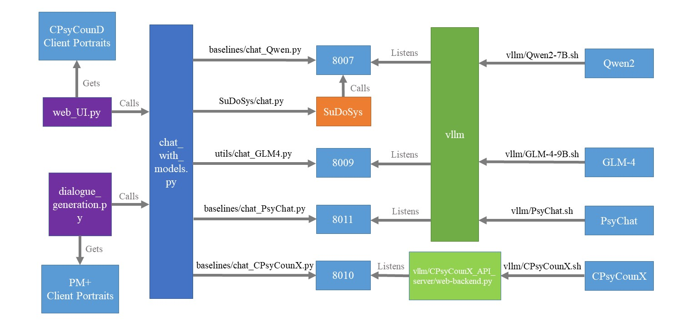

# SuDoSys 代码和评估脚本

## 如何运行 SuDoSys？
1. 运行vllm/中的API服务器脚本 Qwen2-7B.sh
2. 修改所有chat_XXX.py 文件中的openai_api_base来对应vllm服务器ip地址和端口
3. 运行 SuDoSys/chat.py 以同 SuDoSys 交互

## 模型评估是如何工作的？
1. web_UI.subj_eval.py 用来创建web前端与人类打分者交互，后者在web中打分后提交到服务器本地保存。
2. dialogue_generation.obj_eval.py 调用 GLM-4 来扮演咨询者与4个咨询师模型交互，产生对话历史。然后由GPT4对对话历史评估来给模型打分。

## 项目架构
参见project-overview.jpg：

## 论文摘要
The Structured Dialogue System for Mental Health, referred to as SuDoSys, is an innovative Large Language Model (LLM)-based chatbot designed to provide psychological counseling. SuDoSys leverages the World Health Organization (WHO)'s Problem Management Plus (PM+) guidelines to deliver stage-aware multi-turn dialogues. Existing methods for employing an LLM in multi-turn psychological counseling typically involve direct fine-tuning using generated dialogues, often neglecting the dynamic stage shifts characteristic of counseling sessions. Unlike previous approaches, SuDoSys considers the different stages of counseling and stores essential information throughout the counseling process, ensuring coherent and directed conversations. The system employs an LLM, a stage-aware instruction generator, a response unpacker, a topic database, and a stage controller to maintain dialogue flow. In addition, we propose a novel technique that simulates counseling clients to interact with the evaluated system and evaluate its performance automatically. When assessed using both automatic and human evaluations, SuDoSys demonstrates its effectiveness in generating logically coherent responses.
