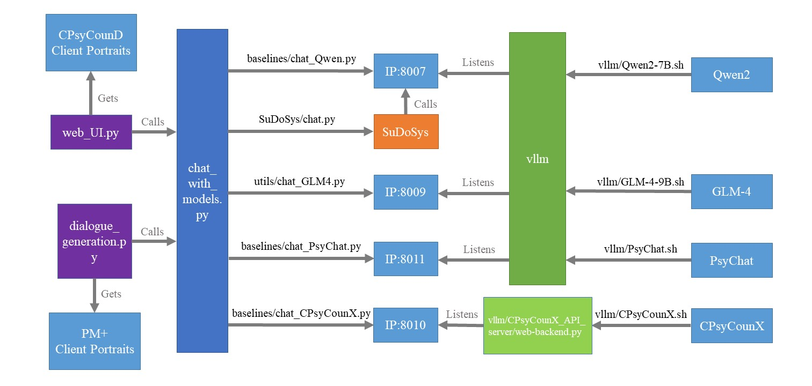

# SuDoSys and its evaluation

## How to run SuDoSys
1. Run API server script Qwen2-7B.sh in vllm/
2. Change openai_api_base in all the chat_XXX.py files correspondingly.
3. Run SuDoSys/chat.py to interact with SuDoSys

## How the evaluation part works
1. web_UI.subj_eval.py serves as an interface to the human assessors for rating the four models.
2. dialogue_generation.obj_eval.py calls GLM-4 to chat with the four models and generate dialogue histories to be assessed by GPT-4.

## Project Architecture
See project-overview.jpg:

## Abstract of the Paper
The Structured Dialogue System for Mental Health, referred to as SuDoSys, is an innovative Large Language Model (LLM)-based chatbot designed to provide psychological counseling. SuDoSys leverages the World Health Organization (WHO)'s Problem Management Plus (PM+) guidelines to deliver stage-aware multi-turn dialogues. Existing methods for employing an LLM in multi-turn psychological counseling typically involve direct fine-tuning using generated dialogues, often neglecting the dynamic stage shifts characteristic of counseling sessions. Unlike previous approaches, SuDoSys considers the different stages of counseling and stores essential information throughout the counseling process, ensuring coherent and directed conversations. The system employs an LLM, a stage-aware instruction generator, a response unpacker, a topic database, and a stage controller to maintain dialogue flow. In addition, we propose a novel technique that simulates counseling clients to interact with the evaluated system and evaluate its performance automatically. When assessed using both automatic and human evaluations, SuDoSys demonstrates its effectiveness in generating logically coherent responses.
